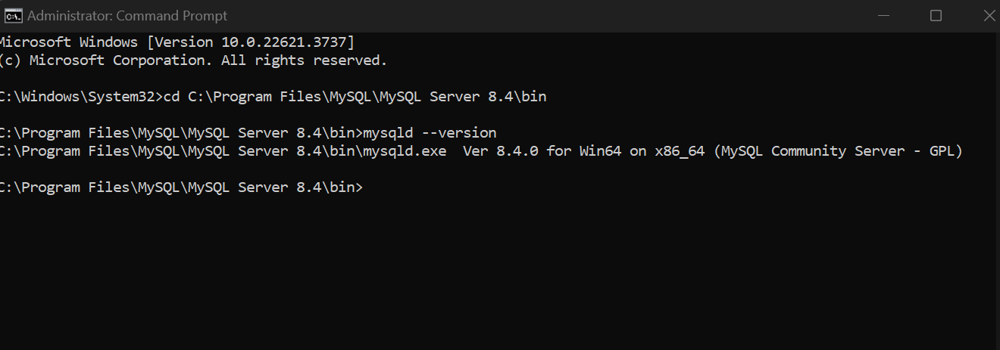

# Dev_Setup
Setup Development Environment

#Assignment: Setting Up Your Developer Environment

#Objective:
This assignment aims to familiarize you with the tools and configurations necessary to set up an efficient developer environment for software engineering projects. Completing this assignment will give you the skills required to set up a robust and productive workspace conducive to coding, debugging, version control, and collaboration.

#Tasks:

1. Select Your Operating System (OS):
   Choose an operating system that best suits your preferences and project requirements. Download and Install Windows 11. https://www.microsoft.com/software-download/windows11

      Navigate to the Microsoft Windows 11 Download page.

      

      Click on "Download now" to download the Installation Assistant.

      

      Run the Installation Assistant and follow the on-screen instructions to upgrade or install Windows 11.

      

      

2. Install a Text Editor or Integrated Development Environment (IDE):
   Select and install a text editor or IDE suitable for your programming languages and workflow. Download and Install Visual Studio Code. https://code.visualstudio.com/Download

      Go to the Visual Studio Code Download page and Choose the appropriate installer for your operating system (Windows).
      
      
      
      Run the installer and follow the setup instructions.

      

3. Set Up Version Control System:
   Install Git and configure it on your local machine. Create a GitHub account for hosting your repositories. Initialize a Git repository for your project and make your first commit. https://github.com

      Download and install Git from Git. and run the installer setup.
      

      
      Create a GitHub account at GitHub by entering your email in the prompt below

      

      Initialize a Git repository for your project and make your first commit.(https://github.com/Kevin-murithi/sample_project.git)

      open gitbash and key in the following commands

      navigate to your projects folder
      
      using a text editor create a python script and save as python_sample.py in the same directory as your project
      
      go back to git bash and run your python script to create the files
      
      initialize Git using "git init" command and add your project files to the git staginng area  using "git add." then commit the files with a message using "git commit -m"
      

      Create a New Repository on GitHub

      Go to GitHub and log in to your account.
      Click on the "New" button to create a new repository.
      Fill in the repository details:
      Repository name: sample_project
      Description: Sample project to demonstrate Git initialization
      Public or Private: Choose according to your preference

      
      Get the Repository URL

      in your gitbash terminal, link your local repository to the GitHub repository using the URL you copied using "git remote add origin"

      

      push your local repository to github using "git push -u origin master"

      

4. Install Necessary Programming Languages and Runtimes:
  Instal Python from http://wwww.python.org programming language required for your project and install their respective compilers, interpreters, or runtimes. Ensure you have the necessary tools to build and execute your code.

      Visit the Python Downloads page and download the latest version.
      
      Run the installer and ensure you check the option to add Python to your PATH.
      
      Verify the installation by running command prompt as administrator and using the "python --version" command
      

5. Install Package Managers:
   If applicable, install package managers like pip (Python).

      run command prompt as administrator and enter the "python -m ensurepip --upgrade" command to install pip
      
      check if the package has been successfully installed using "pip --version" command
      

6. Configure a Database (MySQL):
   Download and install MySQL database. https://dev.mysql.com/downloads/windows/installer/5.7.html

      Choose the appropriate installer for Windows from the MySQL Downloads page.
      
      Follow the installation instructions and configure your MySQL instance.
      
      
      MySQL has successfully been installed. Run the configurator to customize the environment.
      
      choose where MySQL will be stored.
      
      select the local host port number that MySQL will run on.
      
      set up a root password and create a user
      
      
      grant neccessary permissions
      
      import sample databases(optional)
      
      click execute to complete the setup
      
      the configuration is now complete
      
      Verify the installation by connecting to the MySQL server using the command line
      use cd to navigate to the bin folder of MySQL in your program files then use the "mysqld --version" to check if it is running
      

7. Set Up Development Environments and Virtualization (Optional):
   Consider using virtualization tools like Docker or virtual machines to isolate project dependencies and ensure consistent environments across different machines.

8. Explore Extensions and Plugins:
   Explore available extensions, plugins, and add-ons for your chosen text editor or IDE to enhance functionality, such as syntax highlighting, linting, code formatting, and version control integration.

      in visual studio code press ctrl+shift+x to navigate to the extensions section. install the extensions that match your preferences and projects.
      

Challenges encountered along the way.
      1. Installation Issues
            Difficulty installing software packages like Git, Python, or MySQL due to compatibility issues, download errors, or permission problems.

         Strategies.
            Ensure you're downloading the correct version for your operating system.
            Run installers with administrative privileges (right-click > "Run as administrator").
            Check system requirements and ensure your machine meets them.
            Verify internet connectivity and try alternative download sources if available.
            Consult official documentation or community forums for troubleshooting tips.

      2.Configuration Errors
            Incorrect configuration of tools like Git, IDEs, or database servers, leading to connectivity issues or functionality gaps.

         Strategies.
            Refer closely to official documentation and follow step-by-step guides.
            Double-check configuration settings, such as paths, environment variables, and network configurations.
            Use configuration wizards or setup scripts provided by software packages whenever possible.
            Test configurations incrementally to isolate and resolve issues one step at a time.
            Seek help from online communities or forums for specific configuration problems.

9. Document Your Setup:
    Create a comprehensive document outlining the steps you've taken to set up your developer environment. Include any configurations, customizations, or troubleshooting steps encountered during the process. 

#Deliverables:
- Document detailing the setup process with step-by-step instructions and screenshots where necessary.
- A GitHub repository containing a sample project initialized with Git and any necessary configuration files (e.g., .gitignore).
- A reflection on the challenges faced during setup and strategies employed to overcome them.

#Submission:
Submit your document and GitHub repository link through the designated platform or email to the instructor by the specified deadline.

#Evaluation Criteria:**
- Completeness and accuracy of setup documentation.
- Effectiveness of version control implementation.
- Appropriateness of tools selected for the project requirements.
- Clarity of reflection on challenges and solutions encountered.
- Adherence to submission guidelines and deadlines.

Note: Feel free to reach out for clarification or assistance with any aspect of the assignment.
